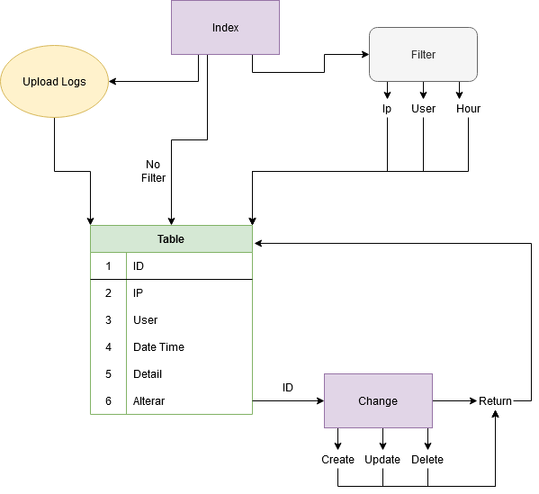

# BenFatto



This project contains 2 pages:
  - Index page
  - Change page

# Index page
The Index page contains:
  - Table that shows:
    - ID
    - IP
    - User
    - Date Time
    - Detail
  - Alterar = this is for Updating / Deleting Row -> Change Page
  - Filter that filters IP / User / Hour. This filter will allow the user to re-load the table with the given filter.
  - A Button that allows the user to upload a log file and insert into the table.
  - A Button that allows the user to create a new row. -> Change Page

Database Select Table: `Select Id, [Ip], [User], [Datetime], [Detail] FROM public.Data WHERE ..`
Database Insert Table: `INSERT INTO public.Data ([Ip],[User],[Datetime],[Detail]) VALUES ..`

# Change page
Change page contains:
  - Update Row
  - Delete Row
  - Create Row

Database Update Table: `UPDATE public.Data Set ... WHERE ID ..`
Database Create Table: `INSERT INTO public.Data ([Ip],[User],[Datetime],[Detail]) VALUES ..`
Database Delete Table: `DELETE FROM public.Data WHERE ID ..`

# Database
```
CREATE TABLE Data (
 ID INT GENERATED ALWAYS AS IDENTITY,
    [Ip]       VARCHAR (20)       NULL,
    [User]     VARCHAR (500)     NULL,
    [Detail]   VARCHAR (2000)    NULL,
    [Datetime] TIMESTAMP with time zone NULL
);
```

I have used Microsoft SQL due to some error in backup locally, so I created all functions of PostgreSQL in comment.